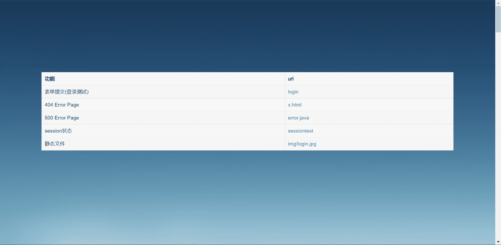
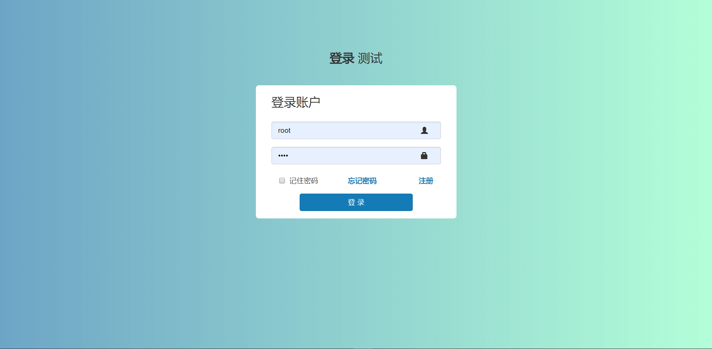

# Java实现的webServer

### 实现的功能
- [x] BIO工作模式
- [ ] NIO工作模式
- [x] 请求接收
- [x] 表单解析
- [X] 文件上传
- [x] Spring风格注解
- [x] Session管理
- [x] 表单处理
### 说明
Config.static配置静态资源路径
@RestController注解编写动态页面
配置文件为config.properties
默认端口为8080

运行后访问http://localhost:8080/

配置文件config.properties
```bash
server.port=8080
#bio nio aio
server.mode=bio
server.session-timeout=10
server.max-connections=100
server.max-thread=500
server.core-thread=0

#静态资源路径
server.static=/html

#视图
server.view-perfix=/template
server.view-suffix=.html
server.charset=utf-8
```

Controller接口
```java
@Controller
public class PageController {

    @Autowired
    Book book;

    // 登录界面1
    @RequestMapping("/login")
    public String login() {
        return "index";
    }

    // 登录界面2
    @RequestMapping("/login2")
    public String log(){
        return "login";
    }
}

```

RestController
```java
@RestController
public class UserController {

    @Autowired
    Book book;

    @RequestMapping("/api/logincheck")
    public String loginCheck(HttpSession session, String name, String password) {
        System.out.println("name" + name);
        System.out.println("password" + password);

        if (name == null) {
            return "用户名为空";
        } else if (password == null) {
            return "密码为空";
        } else {
            session.put("name", name);
            return "success";
        }
    }

    @RequestMapping("/sessiontest")
    public String sessionTest(HttpSession session, String name) {
        System.out.println("name: " + session.get("name"));
        if (session.get("name") == null) {
            session.put("name", name);
            return session.getId() + "<br> you have not login<br>" + session.get("name");
        } else {
            return session.getId() + "<br> hello<br>" + session.get("name");
        }
    }


    @RequestMapping("/")
    public String test(Request request, String name, String password) {
        return this.index(name, password, null);
    }

    @RequestMapping("/index.html")
    public String index(String name, String password, HttpSession session) {
        String data = "login success \n";
        data += new Date().toString() + "\n";
        data += session.get("name") + "\n";
        data += session.get("password") + "\n";
        return data;
    }
}
```


